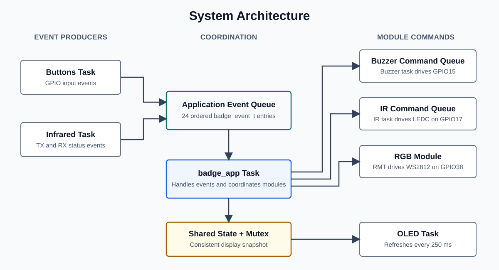

# ESP32-S3 Interactive Conference Badge Firmware v2

Native C firmware built with ESP-IDF and FreeRTOS. The badge exchanges attendee
IDs through infrared, resolves known IDs from an onboard directory, and displays
encountered contacts on a 128 x 64 OLED.

Hardware target: `ESP32-S3-WROOM-1-N16R8`, with 16 MB Quad SPI flash and
8 MB Octal SPI PSRAM. Startup logs report the detected flash and PSRAM sizes.

## Main features

- Five-byte infrared ID frames with CRC-8 validation.
- Automatic transmit, manual transmit, and receive-only modes.
- Preloaded attendee directory and a 64-entry RAM contact list.
- Four OLED pages: profile, contacts, IR status, and system diagnostics.
- Four-button navigation, active-low buzzer feedback, and RGB mode indication.
- FreeRTOS queues, mutexes, queue-drop counters, and task-stack monitoring.

## Badge configuration

Edit `src/include/badge_config.h` before building:

```c
#define BADGE_OWNER_NAME "DemoUser"
#define BADGE_OWNER_ORG "DemoLab"
#define BADGE_OWNER_ID 1
#define BADGE_OWNER_ROLE "STUDENT"

#define BADGE_DIRECTORY_ENTRIES(X) \
  X(BADGE_OWNER_ID, BADGE_OWNER_NAME, BADGE_OWNER_ORG, BADGE_OWNER_ROLE)
```

Add one `X(...)` entry for each known attendee. Unknown received IDs are still
stored and displayed as `UNKNOWN`.

For a single-board optical loopback test:

```c
#define BADGE_IR_SELF_TEST_MODE 1
```

Set it to `0` for normal use so the badge rejects its own ID.

## Controls

- `UP`: previous OLED page.
- `DOWN`: next OLED page.
- `OK`: transmit one ID frame; on the contacts page, show the next four records.
- `BACK`: change IR mode; on the contacts page, clear the contact list.
- RGB: green is automatic, blue is manual, and red is receive-only.

Automatic mode transmits every 5-10 seconds. All modes continue receiving.

## Pin map

```text
OLED SDA       GPIO8
OLED SCL       GPIO9
Button OK      GPIO10
Button DOWN    GPIO11
Button UP      GPIO12
Button BACK    GPIO13
Active buzzer  GPIO15
IR transmitter GPIO17
IR receiver    GPIO20
Onboard RGB    GPIO38
```

The OLED, IR receiver, buttons, and buzzer use the ESP32-S3 3.3 V supply and
must share a common ground.

Discrete IR LED wiring:

```text
GPIO17 -> 220/330 ohm resistor -> IR LED anode
IR LED cathode -> GND
```

## Code entry and modules

```text
app_main()
  -> badge_app_start()
      -> buttons_start()
      -> buzzer_start()
      -> oled_start()
      -> rgb_start()
      -> infrared_start()
```

- `src/app_main.c`: selects diagnostic or normal application mode.
- `src/badge_app.c`: creates the event queue and coordinates all modules.
- `src/badge_contacts.c`: stores up to 64 encountered IDs.
- `src/badge_directory.c`: resolves IDs to attendee profiles.
- `src/badge_diagnostics.c`: records queue, stack, and protocol evidence.
- `src/badge_hardware_info.c`: reports the detected N16R8 memory configuration.
- `src/badge_state.c`: protects OLED-visible state with a mutex.
- `src/modules/infrared.c`: sends, receives, and validates ID frames.
- `src/modules/oled.c`: renders the four OLED pages.
- `src/modules/buttons.c`, `buzzer.c`, and `rgb.c`: local input and feedback.



## FreeRTOS tasks

- `infrared`, priority 7: IR commands, receive frames, and scheduled transmission.
- `badge_app`, priority 6: button and IR event coordination.
- `buzzer`, priority 6: queued audio feedback.
- `buttons`, priority 5: 5 ms sampling and 25 ms debounce.
- `oled`, priority 3: display refresh every 250 ms.

Tasks wait on queues or delays when idle. Four queues transfer commands and
events, while two mutexes protect shared state and the contact list.

## Build and upload

From this directory:

```powershell
powershell -ExecutionPolicy Bypass -File .\tools\pio.ps1 -Target run
powershell -ExecutionPolicy Bypass -File .\tools\pio.ps1 -Target upload
powershell -ExecutionPolicy Bypass -File .\tools\pio.ps1 -Target monitor
```

The helper creates a whitespace-free directory junction because ESP-IDF rejects
project paths containing spaces.

## Verification status

Verified on prototype hardware:

- OLED, four buttons, active-low buzzer, IR activity, and onboard RGB.
- Multi-page interface, serial event logging, and normal task scheduling.
- Controlled single-board optical loopback through transmit, receive, frame
  validation, directory resolution, contact storage, and OLED display.
- Firmware build with ESP-IDF 6.0.1, with queue-drop and task-stack diagnostics.

Evidence boundary:

- Optical range, current consumption, and battery runtime were not measured.
- Two-badge communication was not tested; the optical loopback validates the
  code path but not operation between two independent badges.

## Hardware note

GPIO20 is also the ESP32-S3 native USB D+ pin. This firmware uses GPIO20 for IR
receive, so use the board's USB-to-UART connection or remap `BADGE_PIN_IR_RX`
when native USB is required.
